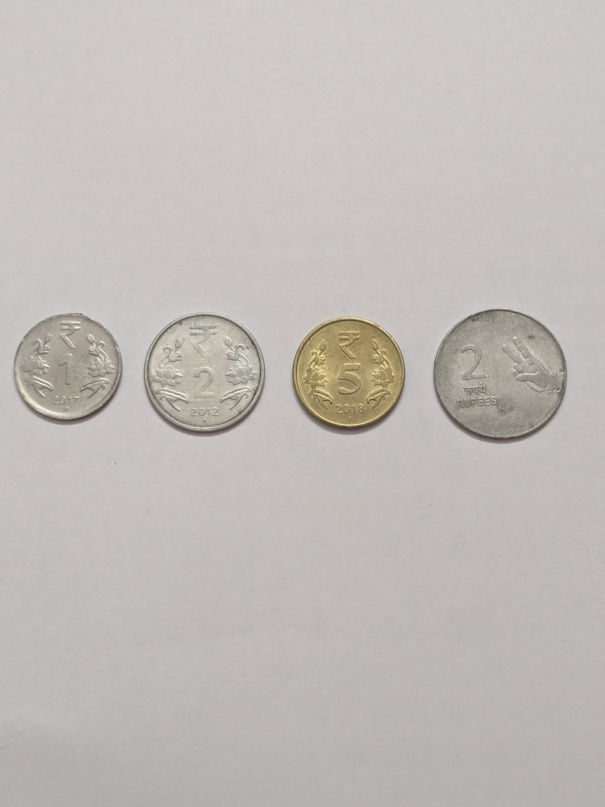
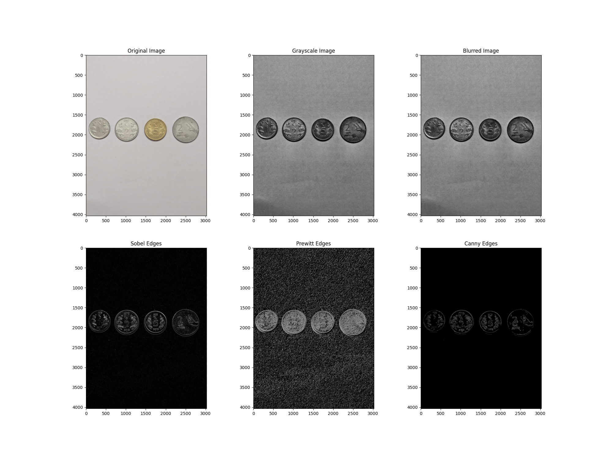
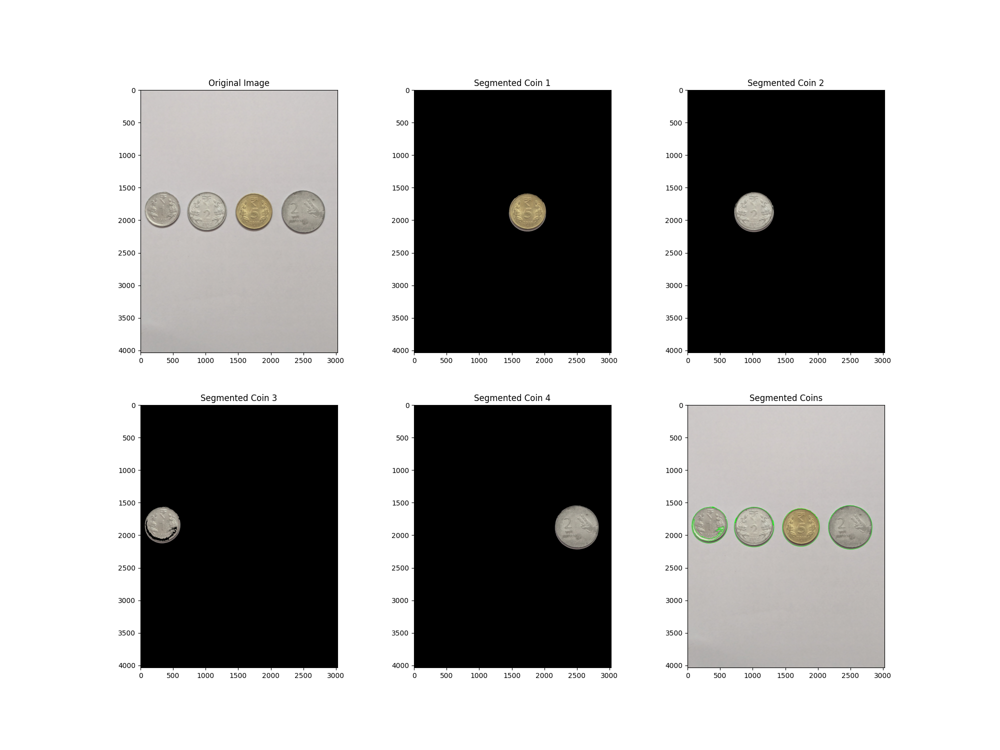
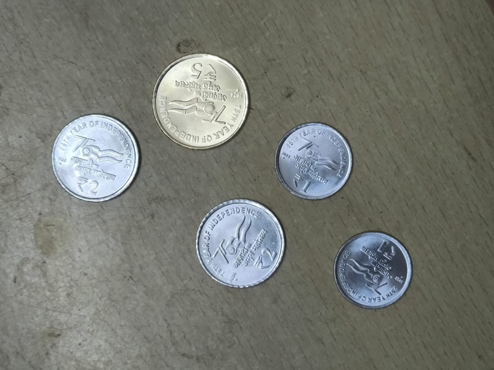
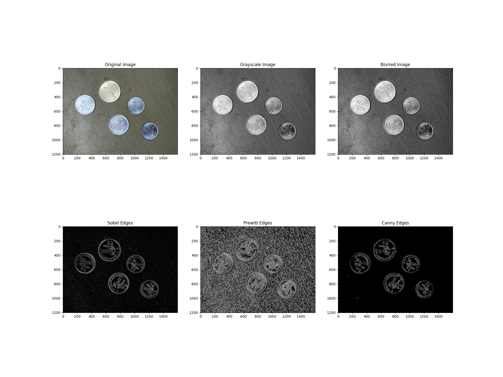
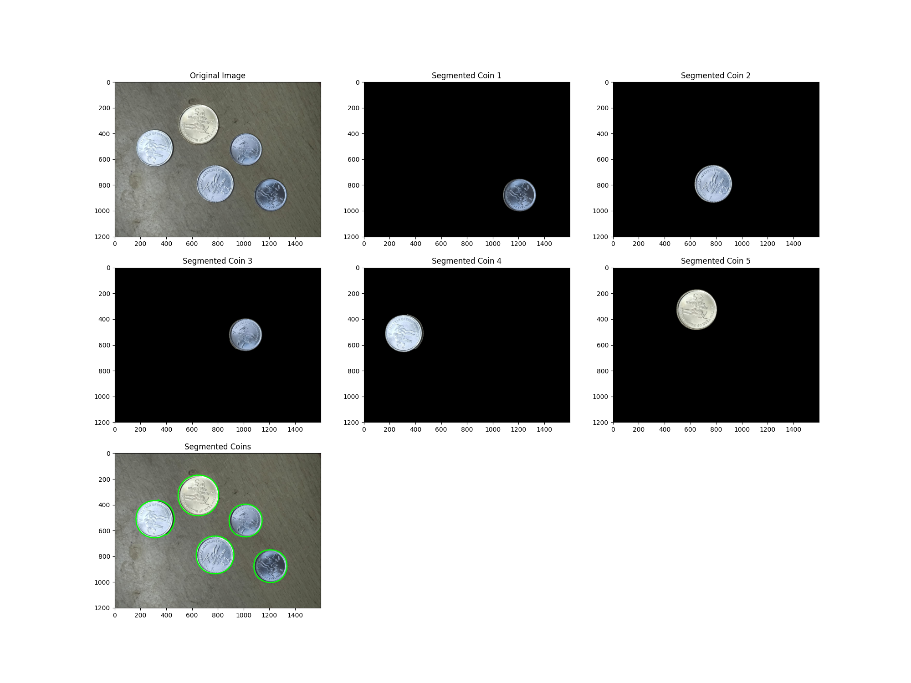

# VR Assignment 1: Coin Detection with segmentation and Panorama Stitching

## Overview

This Assignment consists of two parts:

1. **Coin Detection and Segmentation**: Detect, segment, and count Indian coins from an image using image processing techniques.
2. **Panorama Stitching**: Create a stitched panorama from multiple overlapping images using keypoint detection and image alignment.

## Installation & Dependencies

Ensure you have the following dependencies installed before running the scripts:

```bash
pip install opencv-python numpy matplotlib
```

## Dataset

- Capture or obtain an image containing various Indian coins./ Use the images already present.
- Capture a set of overlapping images using a smartphone for panorama stitching / Use the images already present.
- Place the coin images in a `coin_dataset/` directory within the repository.
- Place the panaroma images in a `panaroma/` directory within the repository.

## Usage Instructions

### Part 1: Coin Detection & Segmentation

Run the following command to execute the coin detection script:

Set the WORKING_DIR in VR_graded_assignment_01_part_1.ipynb

RUN VR_graded_assignment_01_part_1.ipynb

- This script performs edge detection to detect coins.
- Segments individual coins using region-based segmentation.
- Counts the total number of coins and displays the output.

### Part 2: Panorama Stitching

Run the following command to execute the panorama stitching script:

Set the WORKING_DIR in VR_graded_assignment_01_part_2.ipynb

RUN VR_graded_assignment_01_part_2.ipynb

- Extracts key points from overlapping images.
- Aligns and stitches them to create a panorama.
- Saves the final panorama image as output.

## Methodology & Results

### Coin Detection & Segmentation

- **Edge Detection**: Used OpenCV's Canny edge detection, sobel operator and prewitt operator to outline the coins.
- **Region-based Segmentation**: Applied adaptive Gaussian filtering and ostu thresholding along with contour finding.
- **Edge-based Segmentation**: Applied adaptive Gaussian filtering and canny edge detection along with contour finding.
- **Counting Coins**: Implemented a function to count the total number of detected coins.


### Panorama Stitching

- **Feature Detection**: Key points are detected using SIFT (Scale-Invariant Feature Transform).
- **Feature Matching**: Key points are matched using FLANN-based or Brute-Force matching.
- **Homography & Warping**: Images are aligned using homography transformation and blended together.

## Example Outputs for PART 1
- **FOR IMAGE**
</img>
- **Edges**
</img>
- **Segmented Coins and count**
- ***REGION BASED Segmentation***
</img>


- **FOR IMAGE**
</img>
- **Edges**
</img>
- **Segmented Coins and count**
- ***EDGE BASED Segmentation***
</img>


## Example Outputs for PART 2

**KEYPOINT MATCHING**


**FINAL PANAROMA**


